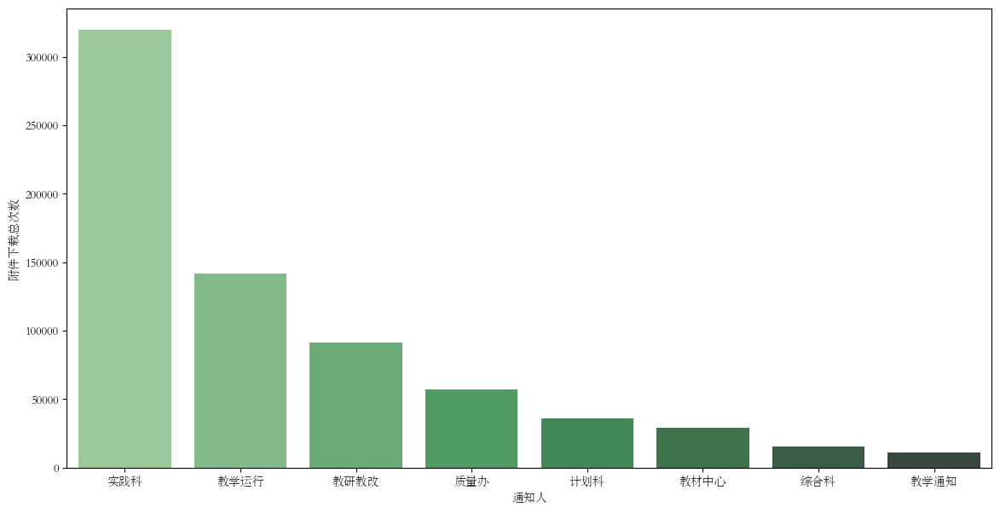

# python爬虫

## 1.Data_Analysis文件夹（教务处数据分析）


”“”

**这些数据范围为从福大教务处刚开始 既 2022 - 10 - 28 开始的范围数据**

“”“
<br>
<br>
<br>

### 1.统计每月的通知数量在2023-2024年的变化

<br>

<br>


<br>
<br>

根据这个从2003到2024的数据（2022因为数据太少而且不精准所以去掉了）
<br>
<br>

- 可以分析出在 2 月 和 7 - 8 月的假期，通知数量不管是均值还是个别数量都出现了谷值  
- 根据置信值区间（98%）可以统计出在每年的九月是通知数量的最高峰（可能和新生的入学有关？军训）
- 而在3-6月随着年份的不同数值不是那么集中，可以从置信的宽度看出来，明显数据差异较大

<br><br>

> 所以可以对未来进行数据分析，接下来的趋势大概还是如m曲线一样的走势


<br>

### 2.统计通知人的类型：

------

<br>
<br>


<br>

可以得到以下结论：

<br>

- 教学运行作为通知人在福大教务处主要发布信息
- 教材中心发布的最少

<br>
<br>


### 3.附件下载次数与通知人的关系

------

<br>
得到了有关于下载次数和通知人之间的图表

<br>



<br>

可以得出以下结论：
<br>


1. 实践科的附件最受欢迎？断崖式领先...
2. 似乎教学通知大家都不看哦，20几年的数据不到2000条

<br>
<br>


代码部分放在了（Data_Analysis文件夹内，数据为output_test


<br>

## 2.Fzu文件夹（福大教务处爬取）

<br>

### 3.福专主页爬取.py

------

<br>

​	通过    `requests`    方法获取到福大教务处的页面地址，先进行解析获取每一页的数据，再通过拼凑的方法得到每一页的 url 进行读取。

> [!CAUTION]
>
> **分别获取到了六个点**

- 通知人

- 标题

- 日期

- 详情页面链接

- 附件下载总次数 （没想到很好的将附件分离出去的操作 故直接进行累加了）

- 附件名字（中间以   `     `   进行分离）

<br>


<br>


> #### ***<u>一些奇怪的注意事项</u>***

1. 建议导入 `time` 库可能是我抓取附件下载地址的时候重复 使用了 `get` 导致循环过多可能被ban


<br>


------

### 2.attachment.py

<br>

​	这个文件作为自建的模块用来处理附件，通过导入页面的详细地址，对附件的名字进行抓包判断，若没有附件直接返回空列表和0（表明没有附件）

<br>

> #### *<u>**一些奇怪的注意事项**</u>*

<br>

1. 对附件名字的处理，这边需要特别点名一些奇怪的党政文件，正常文件的转换为中文输出可以这样子写

<br>   

   `file_name.encode('iso-8859-1').decode('utf-8')`

   <br>

   可是这类文件不一样他需要进行进行这样子的转换才能输出中文

   <br>

   `file_name.encode('utf-8').decode('utf-8')`

   <br>

   而且使用第一类对于这类文件会发生  `UnicodeEncodeError` 的报错
<br><br><br>
   **所以我的解决方案就是使用  try - except 把报错提取 然后进行更改**

<br>

   ```python
           try:
               # 尝试执行的代码
               file_name2.append(file_name1.encode('iso-8859-1').decode('utf-8'))
           except UnicodeEncodeError:
               # 退而求其次
               file_name2.append(file_name1.encode('utf-8').decode('utf-8'))
               print("  **文件  ")
   ```

   <br><br>

   

2.  对于提取下载次数问题的处理，我发现直接用xpath无法提取到下载的次数，再尝试几次无果后，我发现这个下载次数再一个get命令下的返回包中，而且每一个都是相同的，只是id不同，故而我就先将每一个的id提取出来，拼凑成一个url再调用另一个模块 **（get_download_numbers.py）** 对这个下载次数进行处理。


<br><br>

### 3.get_download_numbers.py

<br>

​	这个模块通过提取get命令返回的值进行提取下载次数的操作

<br>

> #### *<u>**一些奇怪的注意事项**</u>*

1. 其实也没啥，就是获取下来的是个str类型的数据，需要稍微对数据进行一些处理，得到最后的数字类型的下载次数


------

### 4.csv_making.py

<br>

​	这个模块主要有两个功能，创建一个csv供写入使用和传入数据写入csv文件中

<br>

> #### *<u>**一些奇怪的注意事项**</u>*

1. 没啥注意的主要是复习了一些有关于文件oi的问题


## 3.zhihu文件夹（爬取知乎的任务）

### 1.zhihu.py

<br>

​	**利用了selenium和etree来实现对于知乎需要下滑才能刷新出新的页面的问题**


> #### *<u>**主要遇到的一些问题**</u>*

- [x] 打开一定需要登录（我就暂时使用了qq快捷登录的操作，偷个懒）
- [x] 单纯的下滑绝对不行他会刷不下去（滑一下上一下，√）
- [x] 可恶的反爬机制，直接不让你动（手动打断点，有反爬了就输个验证码）（差不多爬12个问题左右跳一次吧）


<br>

### 2.finally.csv

里面包含了最终的结果

*格式为：*

*问题名     问题详情（如果有的话）    回答1    .............*