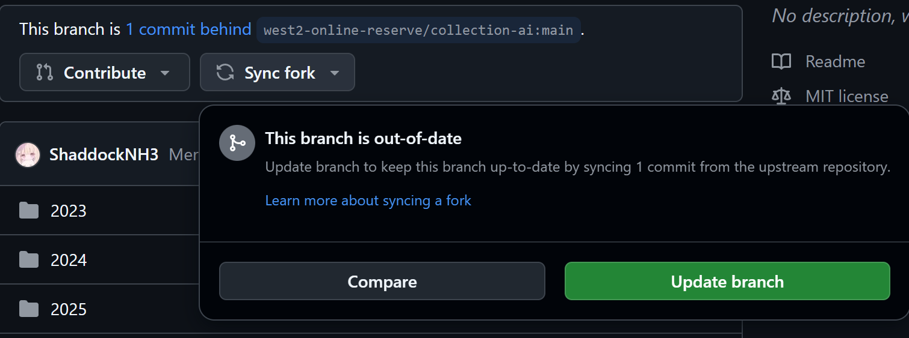

# Collection - ai

这个仓库用作保存有志于加入west2-online的同学的代码/笔记, 这里记录了他们学习过程中的点点滴滴

## Github入门使用

请访问: [飞书 - Git与Github超容易入门](https://west2-online.feishu.cn/wiki/Lsz9w3CiGinXzgkevtmceHZknrf)

## 提交作业

请访问: [飞书 - 如何提交我的作业](https://west2-online.feishu.cn/wiki/Zvqow0CUxig3iWkWQgBcHp4AnHe)

此后你每一次提交作业之前（这个步骤在修改你自己本地的fork仓库之前），在github界面点击update branch把你的仓库更新到最新，如下图：

然后把你自己的本地仓库`git pull`更新到最新，再进行修改本地等操作

## 作业仓库

本仓库请提交作业地址，以及你认为必要的源码以及学习思路（可以参考task仓库里的ExampleName的提交，仓库名字用你的github用户名。

pr请以`{your-student-code} - {the-task-you-completed}`提交，如`02××××××× - task0`

请访问: [ai作业与帮助资料](https://github.com/west2-online/learn-AI)

这个作业与帮助资料是**不断迭代的**(也就是不断在更新, 可能你做了一半作业发现作业内容变了很多)

但是资料请访问上述仓库, 资料是随时都会更新的, 不过我们还是希望你可以养成一个**自我学习查找**的好习惯, 不要过度依赖他人
