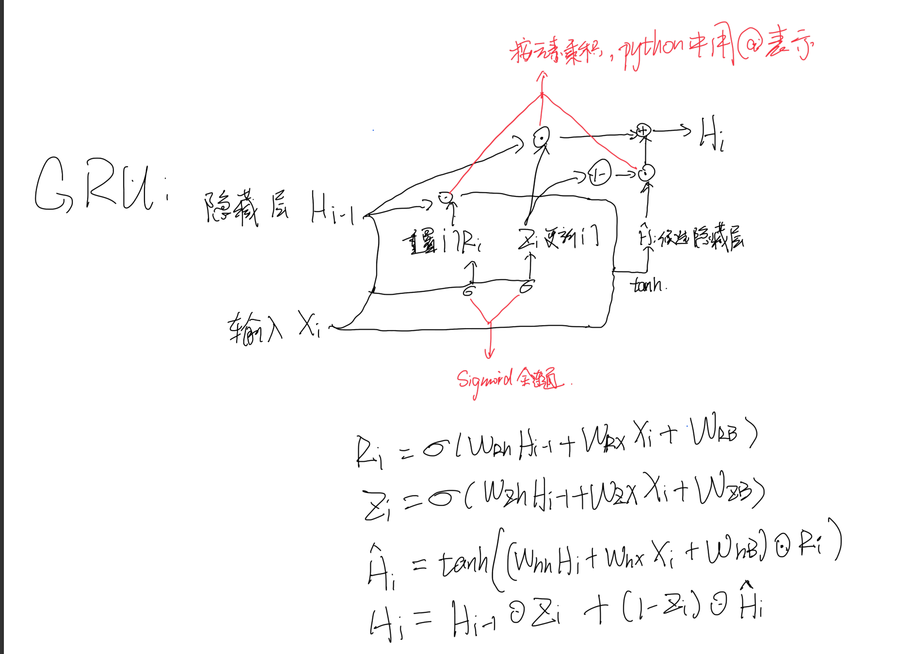

## CIFAR100

### CNN

卷积神经网络

操作过程：卷积核（一个矩阵）在输入矩阵上扫描，每一次框出对应大小的矩阵，进行按元素乘然后求和，得到输出矩阵。

一个卷积核会扫描所有通道的输入，并生成一个通道的输出。

#### 二维卷积层

`nn.Conv2d(in_channels, out_channels, kernel_size, stride = 1, padding = 0)`

`in_channels` 输入通道数；

`out_channels` 输出通道数，即卷积核个数；

`kernel_size` 卷积核大小，可以一个数或是一对数；

`stride` 步幅，默认为 1；

`padding` 填充，默认为 0，一次填充会在上下左右个填充一行（列）。

设输入的矩阵大小为 $X \times X$，输出矩阵大小为 $Y \times Y$，卷积核大小为 $K$，步幅为 $S$，填充为 $P$，则有

$$Y = (X - K + 1 + 2P) / S$$

#### 池化操作
`nn.MaxPool2d(kernel_size,stride,padding)`

一个池化窗口内取最大值，输出规则同上。

`nn.AvgPool2d(kernel_size,stride,padding)`

一个池化窗口内取平均值，输出规则同上。

### 常见模型

#### LeNet

较为简单的 CNN 模型，使用了 2 层卷积核大小为 $5 \times 5$ 的卷积层，两层 $2 \times 2$ 的最大池化层，中间使用 Sigmoid （$\text{Sigmoid}(x) = \Large\frac{1}{1 + e^{-x}}$）函数作为激活函数。

代码：
```
nn.Conv2d(3, 6, 5, padding = 2),
nn.Sigmoid(),
nn.MaxPool2d(2, 2),
nn.Conv2d(6, 16, 5),
nn.Sigmoid(),
nn.MaxPool2d(2, 2),
nn.Flatten(),
nn.Linear(16 * 6 * 6, 120),
nn.ReLU(),
nn.Linear(120, 100)
```
在 10 个 epoch 左右最高曾达到过 30% 正确率。

#### AlexNet

较为复杂，主要由 5 个卷积层和 3 个全连接层组成。

代码：
```
nn.Conv2d(3, 96, 11, 4, padding = 1),
nn.ReLU(),
nn.MaxPool2d(3, 2),
nn.Conv2d(96, 384, 5, padding = 2),
nn.BatchNorm2d(384),
nn.ReLU(),
nn.MaxPool2d(3, 2),
nn.Conv2d(384, 512, 3, padding = 1),
nn.BatchNorm2d(512),
nn.ReLU(),
nn.Conv2d(512, 384, 3, padding = 1),
nn.BatchNorm2d(384),
nn.ReLU(),
nn.Conv2d(384, 256, 3, padding = 1),
nn.BatchNorm2d(256),
nn.ReLU(),
nn.MaxPool2d(3, 2),
nn.Flatten(),
nn.Linear(6400, 4096),
nn.ReLU(),
nn.Dropout(),
nn.Linear(4096, 2048),
nn.ReLU(),
nn.Dropout(),
nn.Linear(2048, 100)
```
其中引入了两种优化方案：`nn.Dropout()` 和 `nn.BatchNorm2d()`

`nn.Dropout()` 使当前节点以一定概率在当前轮停止工作，有利于防止过拟合，使神经网络不过于依赖某些节点，其中可以填写参数 `p` 控制节点停止工作的概率。

`nn.BatchNorm2d()` 批量归一化，$y = \beta + \gamma\Large{\frac{x - \mu}{\sigma}} $，其中 $\beta$，$\gamma$ 为可学习参数，$\mu$ 为均值，$\sigma$ 为方差。这样做可以加入噪声，控制模型复杂度。

在训练 20 个 epoch 后可以达到 62% 正确率，此时 test loss 约为 1.7，但模型参数大小较大，超过 150MB。

#### ResNet

残差网络

使用残差映射，即 $f(x) - x$，效果如图所示：


残差网络的基本单位是残差块，就是实现上述功能的。

残差块代码：
```
class Residual(nn.Module):
    def __init__(self, in_channels, out_channels, dif = False, strides = 1):
        super().__init__()
        self.work1 = nn.Sequential(
            nn.Conv2d(in_channels, out_channels, 3, padding = 1, stride = strides, bias=False),
            nn.BatchNorm2d(out_channels),
            nn.ReLU(),
            nn.Conv2d(out_channels, out_channels, 3, padding = 1, bias=False),
            nn.BatchNorm2d(out_channels),
        )
        self.work2 = nn.Sequential()
        if dif:
            self.work2 = nn.Sequential(
                nn.Conv2d(in_channels, out_channels, 1, stride = strides, bias=False)
            )

    def forward(self, x):
        res = self.work1(x)
        res += self.work2(x)
        res = F.relu(res)
        return res
```

此残差块的基本形式为两个 $3 \times 3$ 的卷积层后面接归一化层和 ReLU 层，然后再与输入相加。

需要注意的是如果输入通道与输出通道不同，则需要一个 $1 \times 1$ 的卷积层对输入进行通道修改。

此后我们还需要一个函数调使用残差块构建模块：

```
def ResNet_Block(in_channels, out_channels, block_num, first_block = False):
    res = []
    for i in range(block_num):
        if i == 0 and not first_block:
            res.append(Residual(in_channels, out_channels, dif=True, strides= 2))
        else:
            res.append(Residual(out_channels, out_channels))
    return res
```

其中 `block_num` 为一个模块中使用的残差块个数。

最后我们可以通过如下方式构造一种 ResNet：
```
class CNN(nn.Module):
    def __init__(self):
        super().__init__()
        self.b1 = nn.Sequential(
            nn.Conv2d(3, 64, 7, 2, 3, bias=False),
            nn.BatchNorm2d(64),
            # nn.ReLU(),
            nn.MaxPool2d(3, 2, 1),
        )
        self.b2 = nn.Sequential(*ResNet_Block(64, 64, 2, first_block=True))
        self.b3 = nn.Sequential(*ResNet_Block(64, 128, 2))
        self.b4 = nn.Sequential(*ResNet_Block(128, 256, 2))
        # self.b5 = nn.Sequential(*ResNet_Block(256, 512, 2))
        self.f1 = nn.AdaptiveAvgPool2d((1, 1))
            #nn.Flatten(),
        self.f2 = nn.Linear(256, 100)
    def forward(self, x):
        res = self.b1(x)
        res = self.b2(res)
        res = self.b3(res)
        res = self.b4(res)
        # res = self.b5(res)
        res = self.f1(res)
        res = res.reshape(x.shape[0], -1)
        res = self.f2(res)
        return res
```

可以在 13 个 epoch 达到 61% 的正确率，此时 test loss 约为 1.4，模型参数大小较小，仅占10.71MB。

### RNN 

循环神经网络

通常用于序列上的预测相关问题

包含隐藏层 $h$，通过隐藏层得出输出

设输入为 $x$，输出为 $y$，隐藏层为 $h$，则对于隐藏层 $h_i$ 和输出 $y_i$，存在:

$$h_i = W_{hx}x_i + W_{hh}h_{i-1} + W_{hb}$$
$$y_i = W_{yh}h_i + W_{yb}$$

`nn.RNN(input_size, hidden_size, num_layers = 1)`

`input_size` 输入大小

`hidden_size` 隐藏层大小

`num_layers` 隐藏层层数，默认为 1

其输出为输出和隐藏状态。

同时还有优化方案 GRU 和 LSTM 可以缓解梯度爆炸和梯度消失




`nn.GRU` 及 `nn.LSTM` 与 `nn.RNN` 用法基本一致

### 使用RNN解决CIFAR100分类问题

先对原图像进行部分卷积，然后再把数据每行当作序列的一个元素，整张图像就是长度为行数的序列，然后再在放到RNN上训练。

代码：
```
class RNN(nn.Module):
    def __init__(self, rnn_layer, vocab_size):
        super().__init__()
        self.b1 = nn.Sequential(
            nn.Conv2d(3, 512, kernel_size=3, stride=1, padding=1),
            nn.BatchNorm2d(512),
            nn.ReLU(),
            # nn.MaxPool2d(kernel_size=2, stride=2),
            nn.Conv2d(512, 512, kernel_size=3, stride=1, padding=1),
            nn.BatchNorm2d(512),
            nn.ReLU(),
            nn.MaxPool2d(kernel_size=2, stride=2),
            nn.Conv2d(512, 256, kernel_size=3, stride=1, padding=1),
            nn.BatchNorm2d(256),
            nn.ReLU(),
            nn.MaxPool2d(kernel_size=2, stride=2),
            nn.Conv2d(256, 128, kernel_size=3, stride=1, padding=1),
            nn.BatchNorm2d(128),
            nn.ReLU(),
            # nn.MaxPool2d(kernel_size=2, stride=2),
        )
        self.rnn = rnn_layer
        self.vocab_size = vocab_size
        self.num_hiddens = self.rnn.hidden_size
        self.flatten = nn.Flatten()
        if not self.rnn.bidirectional:
            self.num_dir = 1
            self.linear = nn.Linear(self.num_hiddens, 100)
        else:
            self.num_dir = 2
            self.linear = nn.Linear(self.num_hiddens * 2, 100)
    
    def forward(self, inputs, state):
        x = self.b1(inputs)
        x = x.permute(0, 2, 3, 1).contiguous().view(batch_size, -1,128 * 8)
        y, state = self.rnn(x)
        output = self.linear(y[:, -1, :])
        return output, state
```

训练 15 个 epoch 可以得到 60% 左右的正确率，同时 test loss 约为 1.6，模型参数大小约为 10MB。