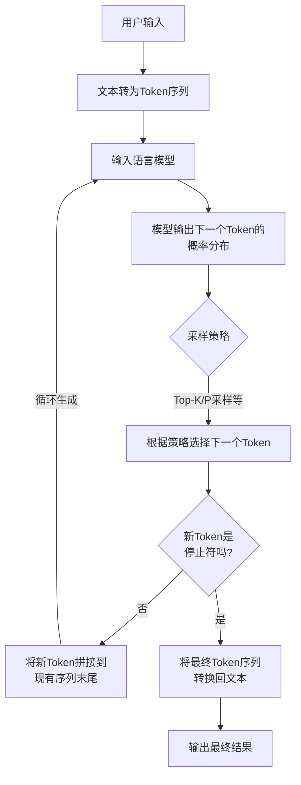

# 李宏毅生成式AI导论 (2025)

## 1.生成式AI基本原理

### token
语言模型理解文字的基本单位是token，token是模型输入输出的基本单位

### 模型
模型可以接受tokens作为输入，然后输出下一个token的概率分布

### 基本原理

将用户输入转为tokens后输入模型，得到下一个token的概率分布，根据概率随机选择概率前top_k的token，并且拼接到用户输入tokens后，然后继续输入模型，直到满足条件停止

