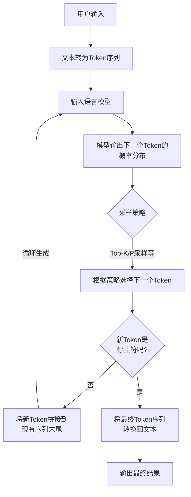

# 李宏毅生成式AI导论 (2025)

## 1.生成式AI基本原理

### token

语言模型理解文字的基本单位是token，token是模型输入输出的基本单位

### 模型

模型可以接受tokens作为输入，然后输出下一个token的概率分布

### 基本原理

将用户输入转为tokens后输入模型，得到下一个token的概率分布，根据概率随机选择概率前top_k的token，并且拼接到用户输入tokens后，然后继续输入模型，直到满足条件停止

## 2.Prompt和Context

### Prompt

模型的提示词，用来引导模型回答问题，一般放在开头，提示词会含有时间等即时信息和模型知识有效时间，以便模型使用。适当修改提示词，可以提高模型回答正确问题的准确率，对老模型(如：GPT3)提升较大，对新模型提升有限。

### Context

模型上下文，大概是模型的Memory，较长的上下文能够提高模型处理大信息任务的能力，模型可以在上下文中调用工具、思考等。大概是Prompt已经卷饱和了，所以Context成为优化的主要阵地，利用算法或模型去筛选和概括模型需要存储的上下文内容，可以优化模型处理信息的准确性，更好的利用模型的上下文。

## 3.模型内部原理

模型运作主要依赖于模型的多层结构，每个token embedding都会被按顺序同时丢入某一层，然后得到一层新的向量Representation，然后继续被丢入下一层，经过所有层后，末端最后一个Representation最后丢入LM Head进行Unembedding，得到预测下一个token的可能性分布Logit

### Token Embedding

输入转为tokens后会被丢尽Embedding Table里，然后每个token都会变成一个向量，且同一个token被embedding后得到的向量是相同的。

### Layer

Layer使模型可以考虑tokens的上下文(尤其是Self-attention Layer)，每经过一层Layer，模型对tokens的理解都会加强

### LM Head

经过所有Layer后，会得到一排向量，把向量塞进LM Head后就会得到一排向量，表示模型预测下一个token的可能性Logit

### Softmax

Logit通过Softmax算法后会得到下一个token的几率分布，Softmax可以使概率两极分化，让大概率更大，小概率更小，从而减小小概率token被选中的概率。其中提高Softmax参数Temperature可以让概率更加平缓，从而增加小概率token被选中的概率，从而提高模型的创意。

## 4.评估模型

### 与标准答案比较

将模型输出结果与标准答案进行比较，效率高、成本低，但是模型输出结果不一定和标准答案形式一致，比较算法较为复杂，且无法评价无标准答案的问题（例如：作文、作诗等）。

### 模型评估模型

使用模型给模型打分，效率高、人工成本低，但是模型无法辨别待测模型输出的真伪，可能会给胡编乱造模型打高分。

### 人工评估模型

由人工来给模型打分，评估模型的精确性会强于前两者，但是效率低、人工成本高、主观因素重。

## 5.训练模型

### 第一阶段 (预训练)

1. 通过爬虫等途径获取训练数据
2. 清洗数据
    - 过滤色情、暴力等有害内容
    - 去除网页中无意义的 HTML 符号
    - 控制数据质量，保留像教科书、百科全书那样的高质量文本
    - 去除重复内容，避免模型输出高度重复的句子。

3. 将数据拆分为多个训练样本
4. 自监督学习
5. 模型学会大量的语言知识与世界知识

### 第二阶段 (指令微调)

通过人工数据标注构建接龙来微调语言模型，也称为监督式学习

#### 适配器

在保持原始参数不变的前提下，新增少
量参数进行训练。这使得模型最终的参数不会与初始参数相差太大，同时也降低了计算负担。

#### 选择路线

- 打造专才
- 打造通才

### 第三阶段 (人类反馈强化学习)

模型通过收集人类反馈，对比不同答案得到的反馈，进行强化学习，优化输出结果的整体质量
